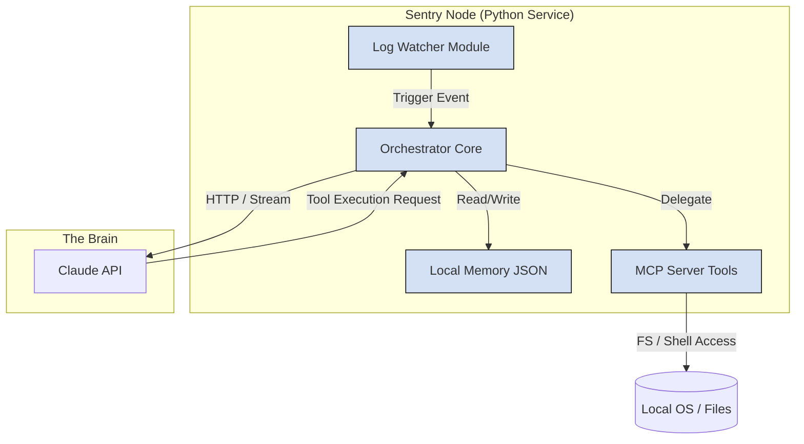
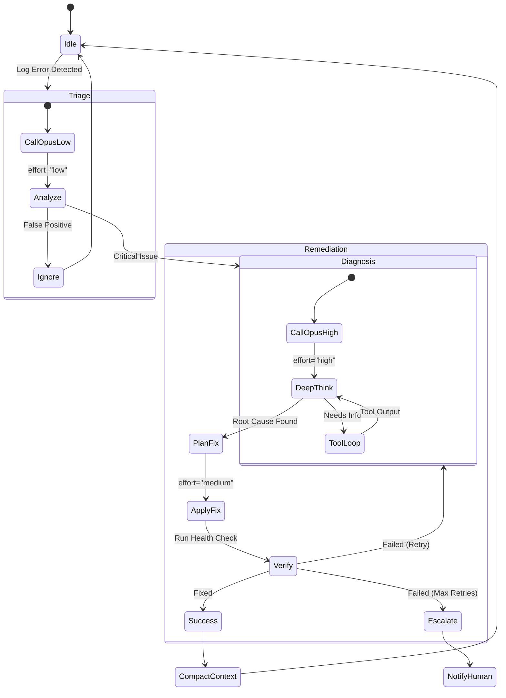

# Design Doc: Sentry (v1.0)

## 1. Executive Summary

Sentry is a "Self-Healing Server Monitor" that uses **Anthropic Claude LLMs** to diagnose and fix infrastructure incidents. Unlike traditional monitoring (which alerts humans) or rigid automation (which runs scripts), Sentry uses **Adaptive Thinking** to reason about unique errors and strictly defined **MCP Tools** to execute fixes.

> **Model Flexibility:** The model is fully configurable via `ANTHROPIC_MODEL` or `BEDROCK_GATEWAY_MODEL` environment variables. While the system defaults to Claude Opus 4 and is optimized for its extended thinking capabilities, any compatible Claude model (Opus, Sonnet, Haiku) can be used. The adaptive effort system (`low`/`medium`/`high`/`disabled`) adjusts reasoning depth regardless of the underlying model.

### 1.1 Goals

* **Autonomous Triage:** Reduce "PagerDuty" noise by 90% by resolving routine errors (disk space, service restarts) without human intervention.
* **Context Continuity:** Maintain a long-running "memory" of server health using Claude’s 1M context window and context compaction.
* **Safety First:** Prevent "hallucinated destructive commands" via strict MCP protocol and read-only default modes.

### 1.2 Non-Goals

* **Real-time Metrics:** Sentry is not a replacement for Datadog/Prometheus. It reacts to *events*, it does not stream charts.
* **Multi-Agent Swarms:** We explicitly avoid "Chatty" agent-to-agent architectures to reduce latency and cost.

### 1.3 Implementation Status

✅ **Fully implemented** with 442 passing tests (97% coverage), Docker microservice deployment, React dashboard, Zero Trust security, and Service Awareness Layer. See Section 11 for implementation details.

---

## 2. System Architecture

We utilize a **Controller/Worker** pattern. The reasoning engine (Opus) is decoupled from the execution environment (Sentry Node).

### 2.1 System Context Diagram (C4 Level 1)

This diagram illustrates how Sentry sits between the Administrator and the Server.


### 2.2 Container Diagram (C4 Level 2)

The internal modularity of the Sentry Orchestrator.



---

## 3. Key Design Decisions

### 3.1 Decision: Single Configurable Model vs. Multi-Model Pipeline

* **Alternative:** Use Haiku for triage and Opus for fixing.
* **Decision:** Use a **single configurable model** (defaulting to Opus 4) with `effort` control. The model is set via `ANTHROPIC_MODEL` or `BEDROCK_GATEWAY_MODEL` environment variables, allowing operators to choose any compatible Claude model.
* **Reasoning:** Handing off context between a "dumb" model and a "smart" model results in loss of nuance (the "Chinese Whispers" effect). A single model with adaptive effort allows us to scale compute up or down *within the same context window*. Operators who need cost efficiency can use Sonnet/Haiku; those who need maximum reasoning can use Opus.

### 3.2 Decision: MCP vs. Direct Shell

* **Alternative:** Allow the LLM to output bash blocks (e.g., ```bash rm -rf / ```).
* **Decision:** Use **Model Context Protocol (MCP)**.
* **Reasoning:** Security. MCP forces the model to use specific, pre-coded functions (`read_file`, `restart_service`). We can enforce input validation at the code level, preventing command injection.

---

## 4. Detailed Component Design

### 4.1 The Orchestrator (State Machine)

The Orchestrator is a finite state machine that manages the "Adaptive Effort" loop. It decides how much "brain power" to allocate based on the error severity.



### 4.2 The "Thinking" Configuration

We map incident types to Opus `thinking` parameters.

| Incident Type | Thinking Type | Effort | Purpose |
| --- | --- | --- | --- |
| **Routine** (Disk full, Service stopped) | `adaptive` | `low` | Quick pattern matching. Fast execution. |
| **Unknown** (Stack trace, Latency spike) | `adaptive` | `high` | Deep reasoning. Analyze code logic vs. system state. |
| **Verification** (Post-fix check) | `disabled` | N/A | Simple deterministic check. |

---

## 5. Interface Design (MCP Tools)

The MCP Server exposes the following tools. Each tool is a Python function decorated with `@mcp.tool`.

### 5.1 Read-Only Tools (Safe)

* **`read_file(path: str)`**
* *Constraint:* Must be within `PROJECT_ROOT`. No `../` allowed.


* **`grep_search(query: str, path: str)`**
* *Constraint:* Max 100 results.


* **`fetch_docs(url: str)`**
* *Constraint:* Allow-list domains only (e.g., `docs.python.org`, `stackoverflow.com`). Used to replace the "Researcher Agent."


### 5.2 Active Tools (Requires Permission or SRE Mode)

* **`run_diagnostics(command: str)`**
* *Constraint:* Whitelist only (`ps aux`, `netstat`, `curl`, `tail`).


* **`apply_patch(diff: str, file_path: str)`**
* *Constraint:* Never overwrites. Creates a backup `.bak` file automatically.


* **`restart_service(service_name: str)`**
* *Constraint:* Rate limited (Max 1 restart / 10 mins).


---

## 6. Data Design: Long-Term Memory

To enable "Self-Healing," we use a local JSON store that acts as RAG (Retrieval-Augmented Generation) for the agent.

**File:** `sentry_memory.json`

```json
{
  "system_fingerprint": "Ubuntu-24.04-Nginx-Postgres",
  "incident_history": [
    {
      "id": "INC-2025-10-01",
      "symptom": "502 Bad Gateway on /api/login",
      "root_cause": "Postgres connection pool exhaustion",
      "fix": "Increased max_connections in pool.py from 10 to 50",
      "vectors": ["postgres", "502", "pool"]
    }
  ]
}

```

**Context Compaction Logic:**
Before every new session, the Orchestrator reads this JSON. If `incident_history` > 50 items, Claude (Effort: High) is triggered to summarize similar incidents into generalized "Rules of Thumb" to save token space.

---

## 7. Process Flow: Incident Response

This sequence diagram details the interaction between the components during a live bug.


---

## 8. Security & Guardrails

Since this agent has write access to code, we implement "Defense in Depth."

1. **The "Human Switch":** A physical file (`STOP_SENTRY`) or Env Var (`SENTRY_MODE=AUDIT`). If set to `AUDIT`, `apply_patch` and `restart_service` simply log the intent but do not execute.
2. **Diff Validation:** The `apply_patch` tool uses `git apply --check` first to ensure the patch applies cleanly to the current HEAD.
3. **Token Circuit Breaker:** If the agent enters a loop and consumes > $5.00 in 10 minutes, the Orchestrator terminates the process.

### 8.1 Zero Trust Security (Implemented)

The implementation goes far beyond the original 3 guardrails. We implemented a full **Zero Trust Architecture** with 15 security layers:

| # | Layer | Module | Description |
|---|-------|--------|-------------|
| 1 | **NHI Vault** | `vault.py` | Non-Human Identity management — each agent gets a unique cryptographic ID with scoped, TTL-based credentials |
| 2 | **AI Gateway** | `ai_gateway.py` | Prompt injection detection (system prompt override, role hijack, delimiter injection) + PII leak prevention (emails, API keys, passwords, IPs) |
| 3 | **Immutable Audit Log** | `audit_log.py` | Hash-chained (blockchain-style) tamper-evident append-only logging |
| 4 | **Agent Throttle** | `agent_throttle.py` | Per-agent rate limiting with configurable windows |
| 5 | **Tool Registry** | `tool_registry.py` | Role-based tool access control (Least Privilege) |
| 6 | **Human Switch** | `security.py` | `STOP_SENTRY` file or `SENTRY_MODE=AUDIT` halts writes |
| 7 | **Path Validation** | `security.py` | Resolved paths checked against `PROJECT_ROOT`, no `../` |
| 8 | **Command Whitelist** | `security.py` | Only `ps`, `netstat`, `curl`, `tail`, `df`, `free`, `uptime`, `systemctl status`, `ping` |
| 9 | **URL Allow-List** | `security.py` | Only approved domains for `fetch_docs` |
| 10 | **Input Sanitization** | `security.py` | Strips `;`, `\|`, `` ` ``, `$()`, `&&`, `\|\|` |
| 11 | **Rate Limiting** | `circuit_breaker.py` | Max 1 service restart per 10 minutes per service |
| 12 | **Cost Circuit Breaker** | `circuit_breaker.py` | Auto-halt at $5/10min API spend |
| 13 | **Diff Validation** | `patch_tool.py` | `git apply --check` before writing |
| 14 | **Non-Root Docker** | `Dockerfile` | Runs as `sentry` user with `no-new-privileges` |
| 15 | **Security Headers** | `nginx.conf` | CSP, X-Frame-Options, X-Content-Type-Options |

---

## 9. Service Awareness Layer (Implemented)

A critical architectural insight: **a self-healing monitor is useless if it doesn't understand what it's monitoring.** Without service knowledge, the AI agents receive a raw log line and must figure out everything from scratch — what service produced it, what its dependencies are, what "healthy" looks like, and how to fix it.

The Service Awareness Layer solves this by giving agents a structured model of the monitored infrastructure.

### 9.1 Architecture

```
service_config.yaml
    │
    ▼
ServiceRegistry (loads on startup)
    ├── ServiceDefinition[]     ← name, type, logs, configs, ports, processes
    ├── HealthCheck[]           ← per-service health commands + intervals
    ├── ServiceDependency[]     ← directed dependency graph (requires/optional)
    ├── KnownErrorPattern[]     ← regex → explanation mapping
    └── Runbook[]               ← ordered remediation steps
```

### 9.2 Data Flow

1. **Startup:** Orchestrator loads `service_config.yaml` → `ServiceRegistry` → populates `system_fingerprint` in memory store with real topology (services, ports, dependencies)
2. **Per Incident:** When a log event triggers, the engine matches `source_file` to a service via glob patterns, then builds a rich context string containing:
   - Service description, type, config files, ports, processes
   - Known error pattern matches (regex matched against the log line)
   - Ordered runbook steps
   - Full dependency chain with health check commands
3. **Agent Prompts:** The `service_context` is injected into triage and diagnosis prompts so agents make **informed decisions** rather than blind guesses

### 9.3 Service Definition Schema

Each service is defined in YAML with the following fields:

| Field | Required | Description |
|-------|----------|-------------|
| `name` | ✅ | Unique service identifier |
| `service_type` | ✅ | Enum: `web_server`, `app_server`, `database`, `cache`, `queue`, `proxy`, `custom` |
| `description` | ✅ | Human-readable description of what the service does |
| `log_files` | ✅ | Glob patterns for log files this service writes to |
| `config_files` | | Configuration file paths |
| `ports` | | Network ports the service listens on |
| `processes` | | Process names to look for in `ps` output |
| `systemd_unit` | | Systemd service name for restart/status commands |
| `health_check` | | Command + interval for health verification |
| `dependencies` | | List of other services this service depends on (with relationship type) |
| `known_error_patterns` | | Regex patterns mapped to explanations |
| `runbook` | | Ordered list of remediation steps |
| `restart_command` | | Custom restart command |
| `reload_command` | | Graceful reload command |
| `notes` | | Free-form operational notes |

### 9.4 Key Capabilities

| Capability | Method | Description |
|-----------|--------|-------------|
| **Log-to-Service Matching** | `match_log_file(path)` | Given a log file path, finds which service owns it via glob matching |
| **Error Pattern Recognition** | `match_error_pattern(line, svc)` | Matches log content against known error patterns → returns explanation |
| **Dependency Resolution** | `get_dependency_chain(name)` | Recursively resolves the full dependency chain for a service |
| **Impact Analysis** | `get_affected_services(name)` | Finds all services that depend on a given service (reverse lookup) |
| **Topology Fingerprint** | `build_topology_fingerprint()` | Generates a system-wide topology summary for the memory store |
| **Incident Context** | `build_service_context_for_incident()` | Builds the full rich context string injected into agent prompts |

### 9.5 Example: What Agents See

When an "upstream timed out" error appears in `watched/nginx-error.log`, the agents receive:

```
=== Service: Nginx Reverse Proxy ===
Type: web_server
Description: Nginx reverse proxy serving static files and forwarding API requests...
Log files: /var/log/nginx/*.log, watched/nginx-error.log
Config files: /etc/nginx/nginx.conf, watched/config/nginx.conf
Ports: 80, 443
Dependencies: app-server (requires)
Restart: systemctl restart nginx
Runbook steps:
  1. Check nginx error log: tail -100 /var/log/nginx/error.log
  2. Validate config syntax: nginx -t
  3. Check if upstream (app-server) is responding: curl localhost:8080/health
⚡ Known error pattern match: Backend app server is slow or not responding
Dependency chain:
  - Backend API Server (app_server) → Health check: curl -sf http://localhost:8080/health
  - PostgreSQL Database (database) → Health check: pg_isready -h localhost -p 5432
  - Redis Cache (cache) → Health check: redis-cli ping
```

This transforms the AI agent from "here's a random log line, figure it out" to "here's exactly what service is affected, what it depends on, and the step-by-step runbook to fix it."

---

## 10. Future Work

* **Slack Integration:** Allow the user to "Chat with Sentry" to ask "Why did you restart the server?"
* **Vector Database:** Migrate `sentry_memory.json` to a local vector store (like ChromaDB) if incident history exceeds 1,000 items.
* **Auto-Discovery:** Automatically discover services via Docker labels, systemd units, or Kubernetes annotations instead of manual YAML configuration.
* **Health Baseline Learning:** Collect health check metrics over time to establish "normal" baselines and detect anomalies.
* **Service-Specific Memory:** Link incident history entries to specific services for better pattern recognition within service context.

---

## 11. Implementation Details

This section documents what was actually built vs. the original design.

### 11.1 Technology Stack

| Component | Technology | Notes |
|-----------|-----------|-------|
| **Backend** | Python 3.12 + FastAPI | REST API gateway, async throughout |
| **Frontend** | React 18 + Vite | Single-page dark-mode dashboard |
| **LLM** | Anthropic Claude (configurable — defaults to Opus 4) | Via direct API or AWS Bedrock Gateway; model set via env vars |
| **Orchestrator** | LangGraph-style state machine | Custom `IncidentGraph` with typed state |
| **Container** | Docker Compose | 2 services: backend (:8000), frontend (:3000) |
| **Testing** | pytest + pytest-asyncio | 442 tests, 97% coverage, TDD approach |
| **Reverse Proxy** | nginx | Frontend serves static + proxies `/api` |

### 11.2 Multi-Agent Architecture

The implementation evolved from the original single-orchestrator design to a **multi-agent pipeline** inspired by OWASP Non-Human Identity (NHI) guidelines:

```
Supervisor (routing only, no LLM)
    ├── Triage Agent     → effort:low,  read-only tools
    ├── Detective Agent  → effort:high, read + diagnostics
    ├── Surgeon Agent    → effort:med,  active tools only
    └── Validator Agent  → effort:off,  diagnostics only
```

Each agent has:
- A **unique Non-Human Identity** (NHI) from the Vault
- **Scoped, time-limited credentials** (TTL-based)
- Access to **only the tools required** for its role (Least Privilege)
- All actions logged to an **immutable audit trail**

#### Tool Access Matrix

| Tool | Supervisor | Triage | Detective | Surgeon | Validator |
|------|:---:|:---:|:---:|:---:|:---:|
| `read_file` | ✅ | ✅ | ✅ | ❌ | ✅ |
| `grep_search` | ✅ | ✅ | ✅ | ❌ | ✅ |
| `fetch_docs` | ✅ | ✅ | ✅ | ❌ | ❌ |
| `run_diagnostics` | ✅ | ❌ | ✅ | ❌ | ✅ |
| `apply_patch` | ✅ | ❌ | ❌ | ✅ | ❌ |
| `restart_service` | ✅ | ❌ | ❌ | ✅ | ❌ |

### 11.3 LLM Provider Abstraction

Supports two backends via a factory pattern (`create_llm_client()`):

1. **Direct Anthropic API** (`OpusLLMClient`) — Uses `anthropic` SDK with extended thinking
2. **AWS Bedrock Access Gateway** (`BedrockGatewayLLMClient`) — OpenAI-compatible proxy for Bedrock-hosted Claude

Both implement the `ILLMClient` interface (SOLID — Dependency Inversion).

### 11.4 SOLID Principles Applied

| Principle | Implementation |
|-----------|---------------|
| **Single Responsibility** | Each agent has exactly one job; each MCP tool is one function |
| **Open/Closed** | Tool registry extensible without modifying agents; new LLM providers via factory |
| **Liskov Substitution** | All agents implement `BaseAgent`; both LLM clients implement `ILLMClient` |
| **Interface Segregation** | Separate `ILLMClient`, `IMemoryStore`, `IToolExecutor` interfaces |
| **Dependency Inversion** | Agents depend on abstractions (`IVault`), not concrete `LocalVault` |

### 11.5 Test Coverage

**442 tests across 16 test files — 97% coverage** (enforced minimum: 95%)

| Test File | Tests | Coverage Area |
|-----------|------:|---------------|
| `test_zero_trust.py` | 62 | Vault NHI, AI Gateway, Audit Log, Throttle, Tool Registry |
| `test_agents.py` | 59 | All 5 agent roles + Supervisor routing (9 paths) |
| `test_tools.py` | 71 | Read-only tools, active tools, executor hardening, retry logic |
| `test_schemas.py` | 46 | LLM output parsing for all agent response formats |
| `test_llm_client.py` | 38 | Provider factory, Anthropic + Bedrock clients, error handling |
| `test_api.py` | 29 | All REST endpoints, config, watcher start/stop |
| `test_security.py` | 26 | Path validation, command whitelist, URL allow-list, stop file |
| `test_engine.py` | 18 | Orchestrator lifecycle, circuit breaker, memory save, FIFO cap |
| `test_watcher.py` | 14 | Log polling, file rotation, queue full, PermissionError |
| `test_config.py` | 14 | 12-factor config loading, defaults, env var parsing |
| `test_services.py` | 14 | Service registry, context builder, topology fingerprint |
| `test_domain_models.py` | 22 | Pydantic domain models, serialization, defaults |
| `test_patch_tool.py` | 11 | apply_patch audit + active mode, git apply, backup/restore |
| `test_circuit_breaker.py` | 10 | Cost tracking, rate limiter, auto-halt thresholds |
| `test_memory.py` | 6 | Memory store CRUD, similarity search, compaction |

### 11.6 Docker Deployment

```yaml
# Two-container microservice architecture
services:
  backend:   # FastAPI on :8000, non-root, healthcheck
  frontend:  # React (nginx) on :3000, security headers, /api proxy
```

Both containers run with `security_opt: no-new-privileges:true`.

### 11.7 Dashboard Features

The React frontend provides:
- **System Status Cards** — Active incidents, resolved count, API cost, circuit breaker
- **Log Watcher Controls** — Start/stop file monitoring
- **Manual Trigger** — Paste error messages for on-demand analysis
- **Zero Trust Security Panel** — 10 security layer status indicators
- **Agent Role Permissions** — Visual tool access matrix per agent
- **Incident Timeline** — Active/resolved tabs with detailed activity logs
- **Long-Term Memory** — Incident history with keyword vectors
- **MCP Tools Reference** — Read-only and active tool documentation
