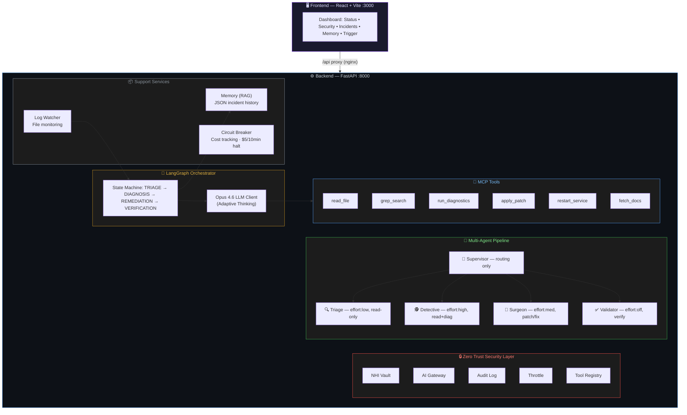

# 🛡️ Claude Sentry — Self-Healing Server Monitor

A production-grade autonomous server monitor powered by **Anthropic Claude Opus 4.6**. It diagnoses infrastructure incidents, proposes fixes, and (with permission) applies them — all via a secure MCP (Model Context Protocol) tool interface with **Zero Trust security**.

## Architecture



## Quick Start

### 1. Clone & Configure

```bash
git clone <repo-url> && cd claude-sentry
cp .env.example .env
# Edit .env — set your LLM provider (see "LLM Providers" below)
```

### 2. Run with Docker

```bash
docker compose up --build
```

- **Dashboard:** http://localhost:3000
- **API:** http://localhost:8000/api/health

### 3. Run Tests

```bash
cd backend
pip install -r requirements.txt
cd ..
python -m pytest -v
```

**Test Results: 165 tests passing** — covering Zero Trust security (43), multi-agent architecture (24), orchestrator, tools, memory, schemas, circuit breaker, and API.

## LLM Providers

Claude Sentry supports two LLM backends via a factory pattern. Set `LLM_PROVIDER` in your `.env`:

### Option A: Direct Anthropic API (default)

```env
LLM_PROVIDER=anthropic
ANTHROPIC_API_KEY=sk-ant-your-key-here
ANTHROPIC_MODEL=claude-opus-4-20250514
```

### Option B: AWS Bedrock Access Gateway

```env
LLM_PROVIDER=bedrock_gateway
BEDROCK_GATEWAY_API_KEY=your-gateway-api-key
BEDROCK_GATEWAY_BASE_URL=https://your-gateway.execute-api.us-east-1.amazonaws.com/api/v1
BEDROCK_GATEWAY_MODEL=anthropic.claude-opus-4-0-20250514
```

## Zero Trust Security Architecture

Every agent is treated as a **potentially compromised actor**. Security is enforced at every layer:

### Non-Human Identity (NHI) Vault
- Each agent receives a unique cryptographic identity (NHI)
- Short-lived scoped credentials (TTL-based)
- Kill switch instantly revokes ALL agent credentials
- No agent can impersonate another

### AI Gateway (Input/Output Firewall)
- **Prompt injection detection**: Blocks system prompt overrides, role hijacking, delimiter injection
- **PII leak prevention**: Detects and redacts emails, API keys, passwords, IP addresses in LLM output
- All AI traffic passes through the gateway — no direct LLM access

### Immutable Audit Log
- Hash-chained (blockchain-style) tamper-evident logging
- Every agent action recorded with timestamp + chain-of-thought
- Tamper detection via hash chain verification
- Append-only — entries cannot be modified or deleted

### Agent Throttle
- Per-agent rate limiting (configurable actions per window)
- Prevents runaway agents from exhausting resources
- Independent limits per agent identity

### Trusted Tool Registry
- Role-based tool access control (Least Privilege)
- Supervisor: 6 tools (all tools — override for emergency use)
- Triage: 3 tools (read_file, grep_search, fetch_docs — read-only)
- Detective: 4 tools (read_file, grep_search, fetch_docs, run_diagnostics)
- Surgeon: 2 tools (apply_patch, restart_service — active tools only)
- Validator: 3 tools (read_file, grep_search, run_diagnostics — verify fixes)

### Defense in Depth Summary

| Layer | Mechanism |
|-------|-----------|
| **NHI Vault** | Unique agent identities with scoped, expiring credentials |
| **AI Gateway** | Prompt injection & PII leak detection on all AI traffic |
| **Audit Log** | Hash-chained immutable logging with tamper detection |
| **Agent Throttle** | Per-agent action rate limiting |
| **Tool Registry** | Role-based least-privilege tool access |
| **Human Switch** | `STOP_SENTRY` file or `SENTRY_MODE=AUDIT` halts all writes |
| **Path Validation** | All file paths resolved & checked against `PROJECT_ROOT` |
| **Command Whitelist** | Only `ps`, `netstat`, `curl`, `tail`, `df`, `free`, `uptime`, `systemctl status`, `ping` |
| **URL Allow-List** | Only approved domains for `fetch_docs` |
| **Input Sanitization** | Strips `;`, `|`, `` ` ``, `$()`, `&&`, `||` from all inputs |
| **Rate Limiting** | Max 1 service restart per 10 minutes per service |
| **Cost Circuit Breaker** | Auto-halts if Opus API costs exceed $5 in 10 minutes |
| **Diff Validation** | `apply_patch` uses `git apply --check` before writing |
| **Non-Root Docker** | Backend runs as `sentry` user; containers use `no-new-privileges` |
| **Security Headers** | CSP, X-Frame-Options, X-Content-Type-Options on frontend |

## Multi-Agent Architecture

Inspired by the OWASP "Non-Human Identity" guidelines. Each agent has:
- A unique NHI (Non-Human Identity)
- Scoped, time-limited credentials
- Access only to tools required for its role
- All actions logged to an immutable audit trail

### Agent Roles

| Agent | Role | Effort Level | Tools | Purpose |
|-------|------|-------------|-------|---------|
| **Supervisor** | Routing | None | 6 (all) | Deterministic routing + emergency override |
| **Triage** | Assessment | Low | 3 | Quick severity classification (read-only) |
| **Detective** | Investigation | High | 4 | Deep root-cause analysis (read + diagnostics) |
| **Surgeon** | Remediation | Medium | 2 | Apply fixes conservatively (active tools only) |
| **Validator** | Verification | Disabled | 3 | Confirm fix worked (read + diagnostics) |

## Operating Modes

| Mode | Behavior |
|------|----------|
| `ACTIVE` | Full autonomous remediation (fix + restart) |
| `AUDIT` | Read-only analysis — logs intent but never modifies (default) |
| `DISABLED` | All actions blocked |

## Project Structure

```
├── backend/
│   ├── agents/           # Multi-agent architecture (NEW)
│   │   ├── base_agent.py     # Abstract base with NHI identity
│   │   ├── supervisor.py     # Routing-only orchestrator
│   │   ├── triage_agent.py   # Severity classification
│   │   ├── detective_agent.py # Root-cause investigation
│   │   ├── surgeon_agent.py  # Fix application
│   │   └── validator_agent.py # Fix verification
│   ├── api/              # FastAPI REST endpoints
│   ├── orchestrator/     # LangGraph state machine + LLM client
│   ├── mcp_tools/        # MCP tool implementations
│   ├── memory/           # JSON-based incident memory (RAG)
│   ├── watcher/          # Log file monitoring
│   ├── shared/
│   │   ├── vault.py          # NHI credential management (NEW)
│   │   ├── ai_gateway.py     # Prompt injection & PII firewall (NEW)
│   │   ├── audit_log.py      # Hash-chained immutable log (NEW)
│   │   ├── agent_throttle.py # Per-agent rate limiting (NEW)
│   │   ├── tool_registry.py  # Role-based tool access (NEW)
│   │   ├── config.py         # 12-factor configuration
│   │   ├── models.py         # Domain models
│   │   ├── security.py       # Path/command/URL validation
│   │   ├── circuit_breaker.py # Cost tracking + auto-halt
│   │   └── interfaces.py     # Abstract base classes (SOLID)
│   ├── tests/
│   │   ├── test_zero_trust.py  # 43 security tests (NEW)
│   │   ├── test_agents.py      # 24 agent tests (NEW)
│   │   ├── test_security.py    # Input validation tests
│   │   ├── test_tools.py       # MCP tool tests
│   │   ├── test_memory.py      # Memory store tests
│   │   ├── test_schemas.py     # LLM output parsing tests
│   │   ├── test_circuit_breaker.py
│   │   ├── test_llm_client.py
│   │   └── test_api.py
│   ├── Dockerfile
│   └── requirements.txt
├── frontend/
│   ├── src/App.jsx       # React dashboard (Zero Trust panel)
│   ├── Dockerfile
│   └── nginx.conf
├── docker-compose.yml
├── pytest.ini
├── .env.example
└── README.md
```

## Design Principles

- **TDD:** 165 tests written FIRST — security, agents, tools, memory, schemas, API
- **SOLID:**
  - **S**ingle Responsibility: Each agent does one thing (triage OR diagnose OR fix OR verify)
  - **O**pen/Closed: Tool registry extensible without modifying agents
  - **L**iskov Substitution: All agents implement BaseAgent interface
  - **I**nterface Segregation: ILLMClient, IMemoryStore, IToolExecutor
  - **D**ependency Inversion: Agents depend on abstractions (IVault), not implementations
- **Clean Code:** Small functions, descriptive names, no magic numbers
- **Zero Trust:** Every agent is untrusted by default; credentials are scoped and temporary
- **Microservices:** Backend + Frontend as separate Docker containers
- **Security First:** Defense in depth — 14 security layers active simultaneously

## API Endpoints

| Method | Path | Description |
|--------|------|-------------|
| GET | `/api/health` | Health check |
| GET | `/api/status` | System status + circuit breaker |
| GET | `/api/incidents` | Active and resolved incidents |
| GET | `/api/incidents/{id}` | Detailed incident with full activity log |
| GET | `/api/memory` | Memory store contents |
| GET | `/api/tools` | Available MCP tool definitions |
| GET | `/api/security` | Zero Trust security posture dashboard |
| POST | `/api/trigger` | Manually trigger incident analysis |
| POST | `/api/watcher/start` | Start log file watcher |
| POST | `/api/watcher/stop` | Stop log file watcher |

## License

MIT
