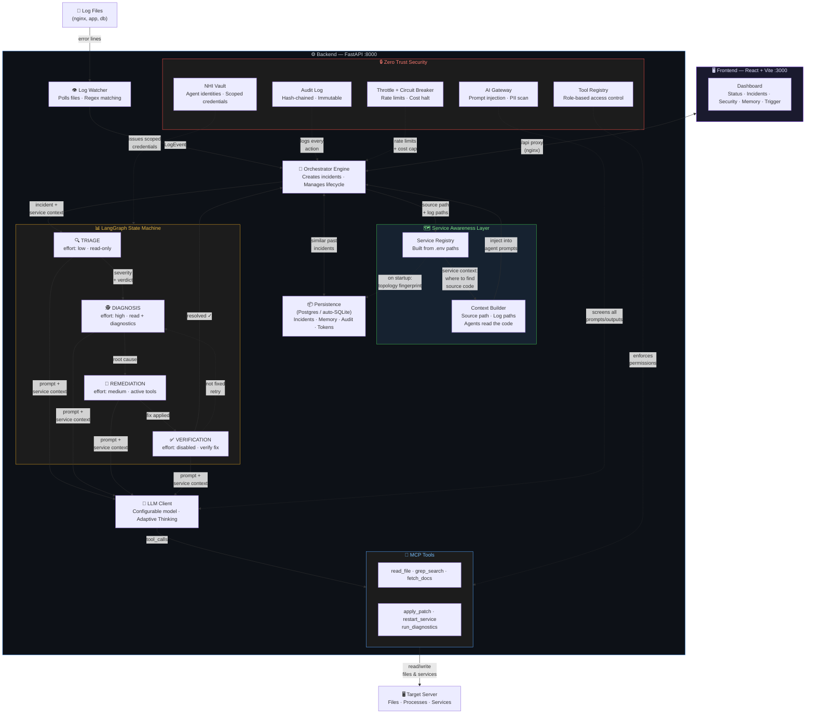
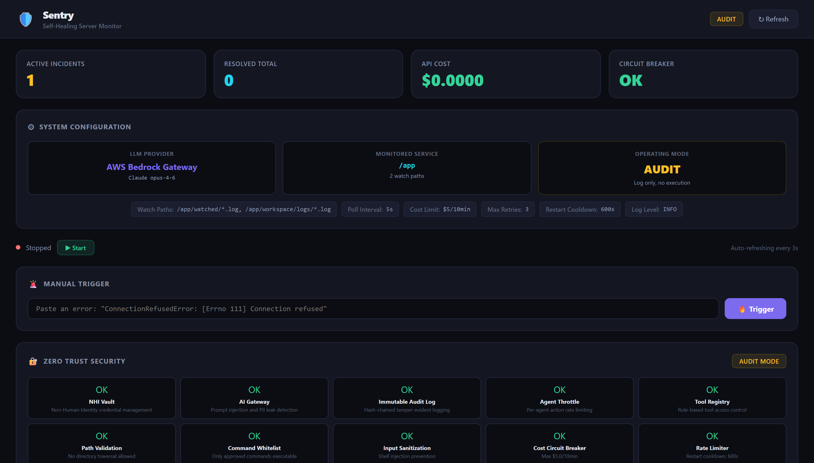
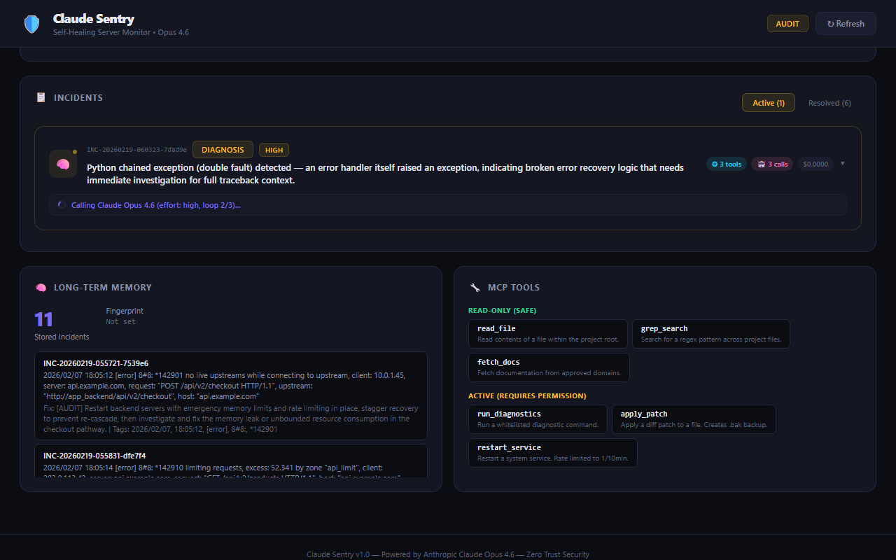
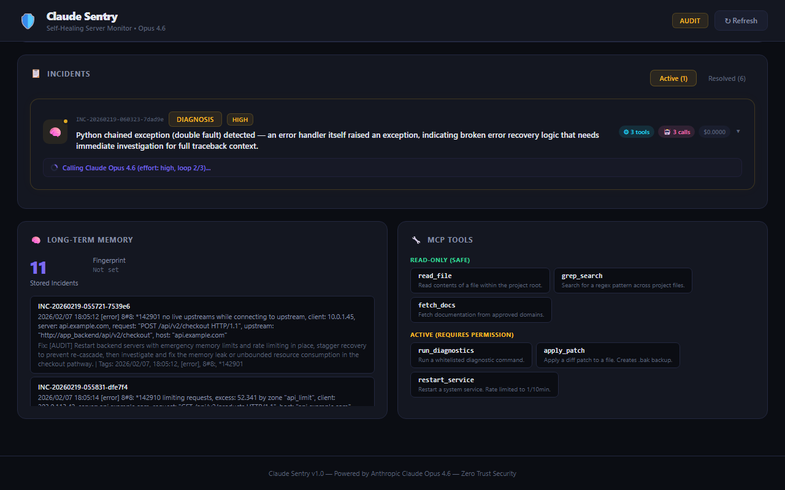
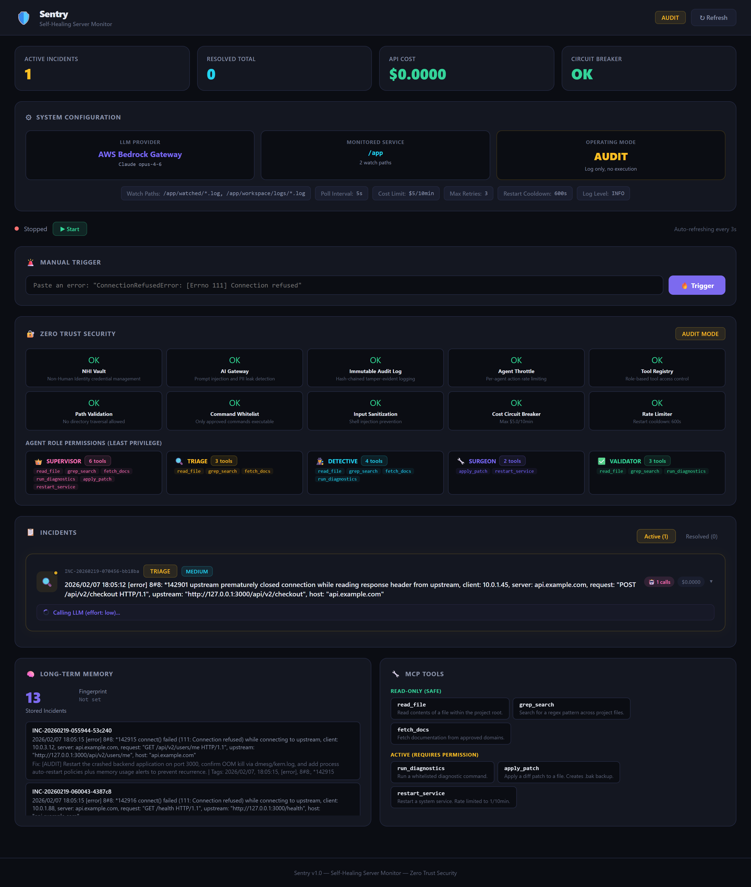

# 🛡️ Sentry — Self-Healing Server Monitor

[](https://github.com/AdityaIndoori/Sentry/actions/workflows/ci.yml)

An autonomous AI service monitor. It uses a **multi-agent pipeline** to continuously monitor logs, diagnose errors, and fix them automatically. Agents interact through a **LangGraph orchestrator**, execute actions via secure **MCP (Model Context Protocol) tools**, and are governed by a **Zero Trust security** layer with 15 defense-in-depth controls.


## Architecture

The diagram below shows how data flows through Sentry — from log detection to AI-driven resolution.


```mermaid
flowchart TB
    %% ── External ──
    Logs["📄 Log Files<br/>(nginx, app, db)"]
    Server["🖥️ Target Server<br/>Files · Processes · Services"]

    %% ── Frontend ──
    subgraph Frontend["🖥️ Frontend — React + Vite :3000"]
        UI["Dashboard<br/>Status · Incidents · Security · Memory · Trigger"]
    end

    %% ── Backend ──
    subgraph Backend["⚙️ Backend — FastAPI :8000"]

        %% Watcher
        Watcher["👁️ Log Watcher<br/>Polls files · Regex matching"]

        %% Orchestrator Engine
        Engine["🧠 Orchestrator Engine<br/>Creates incidents · Manages lifecycle"]

        %% Service Awareness
        subgraph SvcLayer["🗺️ Service Awareness Layer"]
            SvcReg["Service Registry<br/>Built from .env paths"]
            SvcCtx["Context Builder<br/>Source path · Log paths<br/>Agents read the code"]
        end

        %% LangGraph State Machine
        subgraph Graph["📊 LangGraph State Machine"]
            Triage["🔍 TRIAGE<br/>effort: low · read-only"]
            Diagnosis["🕵️ DIAGNOSIS<br/>effort: high · read + diagnostics"]
            Remediation["🔧 REMEDIATION<br/>effort: medium · active tools"]
            Verification["✅ VERIFICATION<br/>effort: disabled · verify fix"]
        end

        %% LLM
        LLM["🤖 LLM Client<br/>Configurable model · Adaptive Thinking"]

        %% MCP Tools
        subgraph Tools["🔧 MCP Tools"]
            ReadOnly["read_file · grep_search · fetch_docs"]
            ActiveTools["apply_patch · restart_service<br/>run_diagnostics"]
        end

        %% Persistence
        Memory["📦 Persistence<br/>(Postgres / auto-SQLite)<br/>Incidents · Memory · Audit · Tokens"]


        %% Zero Trust
        subgraph ZeroTrust["🔒 Zero Trust Security"]
            Vault["NHI Vault<br/>Agent identities · Scoped credentials"]
            Gateway["AI Gateway<br/>Prompt injection · PII scan"]
            AuditLog["Audit Log<br/>Hash-chained · Immutable"]
            Throttle["Throttle + Circuit Breaker<br/>Rate limits · Cost halt"]
            ToolReg["Tool Registry<br/>Role-based access control"]
        end
    end

    %% ═══ DATA FLOW ═══

    %% 1. Log detection
    Logs -->|"error lines"| Watcher
    Watcher -->|"LogEvent"| Engine

    %% 2. Service context enrichment
    Engine -->|"source path<br/>+ log paths"| SvcReg
    SvcReg -->|"service context:<br/>where to find<br/>source code"| SvcCtx
    SvcCtx -->|"inject into<br/>agent prompts"| Engine

    %% 3. Memory lookup
    Engine <-->|"similar past<br/>incidents"| Memory

    %% 4. LangGraph pipeline
    Engine -->|"incident +<br/>service context"| Triage
    Triage -->|"severity<br/>+ verdict"| Diagnosis
    Diagnosis -->|"root cause"| Remediation
    Remediation -->|"fix applied"| Verification
    Verification -->|"resolved ✓"| Engine
    Verification -.->|"not fixed<br/>retry"| Diagnosis

    %% 5. Each node calls LLM with enriched prompts
    Triage & Diagnosis & Remediation & Verification -->|"prompt +<br/>service context"| LLM

    %% 6. LLM may request tool execution
    LLM -->|"tool_calls"| Tools

    %% 7. Tools interact with server
    Tools -->|"read/write<br/>files & services"| Server

    %% 8. Security governs all operations
    Gateway -.->|"screens all<br/>prompts/outputs"| LLM
    ToolReg -.->|"enforces<br/>permissions"| Tools
    AuditLog -.->|"logs every<br/>action"| Engine
    Throttle -.->|"rate limits<br/>+ cost cap"| Engine
    Vault -.->|"issues scoped<br/>credentials"| Graph

    %% 9. Startup: populate fingerprint
    SvcReg -.->|"on startup:<br/>topology fingerprint"| Memory

    %% 10. Frontend reads via API
    Frontend <-->|"/api proxy<br/>(nginx)"| Engine

    %% ═══ STYLES ═══
    style Frontend fill:#1a1a2e,stroke:#7c3aed,color:#e0e0ff
    style Backend fill:#0d1117,stroke:#58a6ff,color:#c9d1d9
    style SvcLayer fill:#162230,stroke:#3fb950,color:#7ee787
    style Graph fill:#1c1c1c,stroke:#d29922,color:#e3b341
    style Tools fill:#1c1c1c,stroke:#58a6ff,color:#79c0ff
    style ZeroTrust fill:#1c1c1c,stroke:#f85149,color:#ff7b72
```

## Screenshots

### Dashboard Overview
Real-time monitoring with active/resolved incident counts, API cost tracking, circuit breaker status, and manual trigger input.



### Agent Roles & Active Incidents
The multi-agent pipeline (Supervisor → Triage → Detective → Surgeon → Validator) with least-privilege tool permissions. Active incidents show the 4-phase progress tracker with live status updates.



### Long-Term Memory & MCP Tools
Incident memory store for pattern matching across past incidents, and the full MCP tool registry split by permission level (read-only vs active).



<details>
<summary>📸 Full Dashboard (click to expand)</summary>



</details>

---

### How It Works (End-to-End Flow)

1. **Detection** — The **Log Watcher** polls monitored log files for error patterns and emits `LogEvent`s
2. **Service Context** — The **Orchestrator Engine** injects the service source code path and log paths into agent prompts, so agents know WHERE to look. Agents then use `read_file` and `grep_search` tools to understand the service themselves.
3. **Memory Enrichment** — The engine queries the **Persistence** layer (Postgres in docker-compose, auto-synthesised SQLite otherwise) for similar past incidents

4. **AI Pipeline** — The engine launches the **LangGraph State Machine** with the incident + service context:
   - **Triage** (low effort) → classifies severity, decides investigate or ignore
   - **Diagnosis** (high effort) → uses tools to read files, run diagnostics, find root cause
   - **Remediation** (medium effort) → proposes/applies fix via tools
   - **Verification** (disabled thinking) → confirms fix worked; retries diagnosis if not
5. **Tool Execution** — Each graph node can request **MCP Tools** (read_file, grep_search, apply_patch, etc.) to interact with the target server
6. **Security Enforcement** — **Zero Trust** wraps everything: AI Gateway screens prompts for injection, Tool Registry enforces per-role access, Audit Log records every action, Circuit Breaker halts runaway costs
7. **Resolution** — Resolved incidents are saved to **Memory** for future pattern matching

## Quick Start

### 1. Clone & Configure

```bash
git clone <repo-url> && cd claude-sentry
cp .env.example .env
# Edit .env — set your API key and SERVICE_HOST_PATH. That's it.
```

> **One file to configure.** Everything lives in `.env` — no need to edit `docker-compose.yml`. Set your API key, point `SERVICE_HOST_PATH` at your service's source code, and the AI agents will read the source code to understand how your service works.

### 2. Run with Docker

```bash
docker compose up --build
```

- **Dashboard:** http://localhost:3000
- **API:** http://localhost:8000/api/health

### 3. Run Tests

```bash
# Backend (unit + E2E)
cd backend && pip install -r requirements.txt && cd ..
set SENTRY_E2E=1 && python -m pytest          # Windows
# or: SENTRY_E2E=1 python -m pytest              # macOS/Linux

# Frontend (vitest + vite build)
cd frontend && npm ci && npm test -- --run && npm run build
```

**Backend:** `724 passed / 11 skipped / 1 xfailed / 0 failed` on CI
(branch coverage **≥ 92%** enforced in `pytest.ini`, hard-fail gate).
**Frontend:** `31 tests passed across 6 vitest suites`; `vite build`
produces a 175 kB bundle (55 kB gzipped).

CI hardens this pipeline on every push + every PR: ruff + mypy
(strict islands on 36 modules, ``--ignore-missing-imports``),
pytest with coverage gate, vitest, vite build, Trivy filesystem +
image scan, CycloneDX SBOM, and a docker multi-stage build that
runs pytest inside the image itself (Dockerfile `test` stage).
All four CI jobs are **hard-fail**; see the  badge at the top of this README for the current master status.

> The per-file test-count table that used to live here became stale
> as the suite grew from ~440 to ~735 tests across P1–P4. The
> canonical per-phase scoreboard (with historical deltas) lives in
> [`ops/E2E_TEST_CATALOG.md`](ops/E2E_TEST_CATALOG.md) under
> **Test Scoreboard**.

Coverage is configured in `pytest.ini` and `.coveragerc`. The HTML
report lands at `htmlcov/index.html`; the CI uploads `coverage.xml`
as the ``backend-coverage`` artifact on every run.


## LLM Providers

Sentry supports two LLM backends via a factory pattern. Set `LLM_PROVIDER` in your `.env`:

### Option A: Direct Anthropic API (default)

```env
LLM_PROVIDER=anthropic
ANTHROPIC_API_KEY=sk-ant-your-key-here
ANTHROPIC_MODEL=claude-opus-4-20250514
```

### Option B: AWS Bedrock Access Gateway

```env
LLM_PROVIDER=bedrock_gateway
BEDROCK_GATEWAY_API_KEY=your-gateway-api-key
BEDROCK_GATEWAY_BASE_URL=https://your-gateway.execute-api.us-east-1.amazonaws.com/api/v1
BEDROCK_GATEWAY_MODEL=anthropic.claude-opus-4-0-20250514
```

## Zero Trust Security Architecture

Every agent is treated as a **potentially compromised actor**. Security is enforced at every layer:

### Non-Human Identity (NHI) Vault
- Each agent receives a unique cryptographic identity (NHI)
- Short-lived scoped credentials (TTL-based)
- Kill switch instantly revokes ALL agent credentials
- No agent can impersonate another

### AI Gateway (Input/Output Firewall)
- **Prompt injection detection**: Blocks system prompt overrides, role hijacking, delimiter injection
- **PII leak prevention**: Detects and redacts emails, API keys, passwords, IP addresses in LLM output
- All AI traffic passes through the gateway — no direct LLM access

### Immutable Audit Log
- Hash-chained (blockchain-style) tamper-evident logging
- Every agent action recorded with timestamp + chain-of-thought
- Tamper detection via hash chain verification
- Append-only — entries cannot be modified or deleted

### Agent Throttle
- Per-agent rate limiting (configurable actions per window)
- Prevents runaway agents from exhausting resources
- Independent limits per agent identity

### Trusted Tool Registry
- Role-based tool access control (Least Privilege)
- Supervisor: 6 tools (all tools — override for emergency use)
- Triage: 3 tools (read_file, grep_search, fetch_docs — read-only)
- Detective: 4 tools (read_file, grep_search, fetch_docs, run_diagnostics)
- Surgeon: 2 tools (apply_patch, restart_service — active tools only)
- Validator: 3 tools (read_file, grep_search, run_diagnostics — verify fixes)

### Defense in Depth Summary

| Layer | Mechanism |
|-------|-----------|
| **NHI Vault** | Unique agent identities with scoped, expiring credentials |
| **AI Gateway** | Prompt injection & PII leak detection on all AI traffic |
| **Audit Log** | Hash-chained immutable logging with tamper detection |
| **Agent Throttle** | Per-agent action rate limiting |
| **Tool Registry** | Role-based least-privilege tool access |
| **Human Switch** | `STOP_SENTRY` file or `SENTRY_MODE=AUDIT` halts all writes |
| **Path Validation** | All file paths resolved & checked against `PROJECT_ROOT` |
| **Command Whitelist** | Only `ps`, `netstat`, `curl`, `tail`, `df`, `free`, `uptime`, `systemctl status`, `ping` |
| **URL Allow-List** | Only approved domains for `fetch_docs` |
| **Input Sanitization** | Strips `;`, `|`, `` ` ``, `$()`, `&&`, `||` from all inputs |
| **Rate Limiting** | Max 1 service restart per 10 minutes per service |
| **Cost Circuit Breaker** | Auto-halts if Opus API costs exceed $5 in 10 minutes |
| **Diff Validation** | `apply_patch` uses `git apply --check` before writing |
| **Non-Root Docker** | Backend runs as `sentry` user; containers use `no-new-privileges` |
| **Security Headers** | CSP, X-Frame-Options, X-Content-Type-Options on frontend |

## Multi-Agent Architecture

Inspired by the OWASP "Non-Human Identity" guidelines. Each agent has:
- A unique NHI (Non-Human Identity)
- Scoped, time-limited credentials
- Access only to tools required for its role
- All actions logged to an immutable audit trail

### Agent Roles

| Agent | Role | Effort Level | Tools | Purpose |
|-------|------|-------------|-------|---------|
| **Supervisor** | Routing | None | 6 (all) | Deterministic routing + emergency override |
| **Triage** | Assessment | Low | 3 | Quick severity classification (read-only) |
| **Detective** | Investigation | High | 4 | Deep root-cause analysis (read + diagnostics) |
| **Surgeon** | Remediation | Medium | 2 | Apply fixes conservatively (active tools only) |
| **Validator** | Verification | Disabled | 3 | Confirm fix worked (read + diagnostics) |

## Service Awareness Layer

Sentry doesn't just watch logs blindly — it **understands what it's monitoring** by reading the service's source code.

### How It Works

You provide two settings in `.env`:
```env
# Host path to your service (Docker mounts this at /app/workspace)
SERVICE_HOST_PATH=/home/user/my-flask-app

# Watch its logs (container paths)
WATCH_PATHS=/app/watched/*.log,/app/workspace/logs/*.log
```

That's it. No YAML files, no manual documentation, no editing `docker-compose.yml`. The AI agents use `read_file` and `grep_search` tools to explore the source code and understand the service architecture at runtime.

### What Agents Receive

When an error is detected, the agents receive context pointing them to the source code:

```
=== SERVICE CONTEXT ===
Source code path: /app/workspace
Log file paths: /var/log/nginx/*.log, /app/watched/*.log

IMPORTANT: You have access to the service's source code via the read_file
and grep_search tools. Use them to understand how the service works —
read config files, entry points, error handlers, and dependencies.
The source code is the ground truth for understanding this service.
=== END SERVICE CONTEXT ===
```

The agents then autonomously explore the codebase — reading config files, entry points, error handlers, and dependency declarations — to understand how the service works and what went wrong.

## Operating Modes

| Mode | Behavior |
|------|----------|
| `ACTIVE` | Full autonomous remediation (fix + restart) |
| `AUDIT` | Read-only analysis — logs intent but never modifies (default) |
| `DISABLED` | All actions blocked |

## Configuration Reference

All settings live in `.env` (copy from `.env.example`). Only **`ANTHROPIC_API_KEY`** and **`SERVICE_HOST_PATH`** are required.

| Variable | Description | Default | Required |
|----------|-------------|---------|:--------:|
| **LLM Provider** | | | |
| `LLM_PROVIDER` | `anthropic` or `bedrock_gateway` | `anthropic` | |
| `ANTHROPIC_API_KEY` | Anthropic API key | — | ✅ |
| `ANTHROPIC_MODEL` | Model identifier | `claude-opus-4-0-20250514` | |
| `ANTHROPIC_MAX_TOKENS` | Max response tokens | `16384` | |
| `BEDROCK_GATEWAY_API_KEY` | Gateway API key (Bedrock mode) | — | if bedrock |
| `BEDROCK_GATEWAY_BASE_URL` | Gateway endpoint URL | — | if bedrock |
| `BEDROCK_GATEWAY_MODEL` | Bedrock model ID | `anthropic.claude-opus-4-0-20250514` | |
| `BEDROCK_GATEWAY_MAX_TOKENS` | Max response tokens | `16384` | |
| **Security** | | | |
| `SENTRY_MODE` | `ACTIVE`, `AUDIT`, or `DISABLED` | `AUDIT` | |
| `PROJECT_ROOT` | Root path agents can access | `/app/workspace` | |
| `STOP_FILE_PATH` | Kill switch file path | `/app/STOP_SENTRY` | |
| `MAX_COST_10MIN` | Max LLM cost per 10 min (USD) | `5.00` | |
| `MAX_RETRIES` | Max remediation retry attempts | `3` | |
| `RESTART_COOLDOWN` | Seconds between service restarts | `600` | |
| **Log Watcher** | | | |
| `WATCH_PATHS` | Comma-separated log file globs | `/var/log/syslog,...` | |
| `POLL_INTERVAL` | Seconds between log polls | `2` | |
| **Service Awareness** | | | |
| `SERVICE_HOST_PATH` | Host path to service source code (Docker mount) | — | ✅ |
| `SERVICE_SOURCE_PATH` | Container path where agents read code | `/app/workspace` | |
| **Memory / Persistence** | | | |
| `DATABASE_URL` | SQLAlchemy async URL for incidents, memory, audit log, API tokens. If unset, Sentry synthesises `sqlite+aiosqlite:///<data_dir>/sentry.db`. | _(auto-SQLite)_ | |
| `MAX_INCIDENTS_COMPACT` | Compact memory after N incidents | `50` | |

| **Server** | | | |
| `API_HOST` | FastAPI bind address | `0.0.0.0` | |
| `API_PORT` | FastAPI port | `8000` | |
| `LOG_LEVEL` | Python log level | `INFO` | |
| `ENVIRONMENT` | Environment name | `production` | |

> **Source of truth:** These variables are read by `backend/shared/config.py` via `load_config()`. The `.env.example` file contains every variable with its default value and inline documentation.

## Project Structure

```
├── backend/
│   ├── agents/           # Multi-agent architecture (NEW)
│   │   ├── base_agent.py     # Abstract base with NHI identity
│   │   ├── supervisor.py     # Routing-only orchestrator
│   │   ├── triage_agent.py   # Severity classification
│   │   ├── detective_agent.py # Root-cause investigation
│   │   ├── surgeon_agent.py  # Fix application
│   │   └── validator_agent.py # Fix verification
│   ├── services/         # Service Awareness Layer (NEW)
│   │   ├── models.py         # ServiceContext — built from .env paths
│   │   └── registry.py       # ServiceRegistry — builds context, no YAML needed
│   ├── api/              # FastAPI REST endpoints (app.py, auth, broadcaster)
│   ├── orchestrator/     # LangGraph state machine + LLM client
│   ├── tools/            # MCP tool implementations (read_file, grep_search,
│   │                     #   fetch_docs, apply_patch, restart_service, run_diagnostics)
│   ├── persistence/      # SQLAlchemy models, async session, Alembic migrations,
│   │                     #   repositories (incident, memory, audit, token) — P1.2+
│   ├── scripts/          # Operator CLIs (create_admin_token, revoke_token, list_tokens)
│   ├── watcher/          # Log file monitoring

│   ├── shared/
│   │   ├── vault.py          # NHI credential management (NEW)
│   │   ├── ai_gateway.py     # Prompt injection & PII firewall (NEW)
│   │   ├── audit_log.py      # Hash-chained immutable log (NEW)
│   │   ├── agent_throttle.py # Per-agent rate limiting (NEW)
│   │   ├── tool_registry.py  # Role-based tool access (NEW)
│   │   ├── config.py         # 12-factor configuration
│   │   ├── models.py         # Domain models
│   │   ├── security.py       # Path/command/URL validation
│   │   ├── circuit_breaker.py # Cost tracking + auto-halt
│   │   └── interfaces.py     # Abstract base classes (SOLID)
│   ├── tests/                # ~735 tests (unit + E2E), ≥ 92% coverage
│   │   ├── conftest.py           # Shared fixtures (security guards, tmp dirs)
│   │   ├── e2e/                  # End-to-end suites (gated by SENTRY_E2E=1)
│   │   │   ├── test_functional.py   # FN-* — the happy-path E2E catalog
│   │   │   ├── test_security.py     # SEC-* — the attacker-facing E2E catalog
│   │   │   └── test_concurrency.py  # CONC-* — races, storms, timeouts
│   │   ├── test_zero_trust.py    # Vault, AI Gateway, Audit Log, Throttle, Tool Registry
│   │   ├── test_agents.py        # All 5 agent roles + Supervisor routing
│   │   ├── test_tools.py         # Read-only tools, active tools, executor hardening
│   │   ├── test_schemas.py       # LLM output parsing for all response formats
│   │   ├── test_llm_client.py    # Provider factory, Anthropic + Bedrock clients
│   │   ├── test_api.py           # All REST endpoints, config, watcher
│   │   ├── test_token_api.py     # REST /api/tokens admin endpoints (P4.6)
│   │   ├── test_token_repo.py    # Postgres API-token repo + hydration (P4.2)
│   │   ├── test_openapi_snapshot.py # Frozen OpenAPI surface (P4.4)
│   │   ├── test_persistence.py   # PostgresMemoryRepo, IncidentRepository, AuditRepo
│   │   ├── test_audit_log_immutability.py # SEC-30 append-only DB triggers (P4.8)
│   │   ├── test_auth.py          # Principal, TokenRegistry, scope gating (P2.1)
│   │   ├── test_broadcaster.py   # IncidentBroadcaster SSE fan-out (P2.4)
│   │   ├── test_bug_regressions.py # Historical P0 regression locks
│   │   ├── test_security.py      # Path, command, URL validation + stop file
│   │   ├── test_engine.py        # Orchestrator lifecycle, circuit breaker, FIFO
│   │   ├── test_graph_nodes.py   # LangGraph node + edge contracts
│   │   ├── test_watcher.py       # Log polling, rotation, queue full, errors
│   │   ├── test_config.py        # 12-factor config loading, defaults
│   │   ├── test_services.py      # Service registry, context builder
│   │   ├── test_secrets.py       # ISecretsProvider backends (P2.2)
│   │   ├── test_metrics.py       # Prometheus counter contract (P2.3b)
│   │   ├── test_domain_models.py # Pydantic domain models, serialization
│   │   ├── test_patch_tool.py    # apply_patch audit + active, git apply
│   │   ├── test_circuit_breaker.py # Cost tracking, rate limiter
│   │   └── test_memory.py        # Memory repo CRUD, fingerprint
│   ├── Dockerfile
│   └── requirements.txt

├── frontend/
│   ├── src/App.jsx       # React dashboard (Zero Trust panel)
│   ├── Dockerfile
│   └── nginx.conf
├── docker-compose.yml
├── pytest.ini
├── .env.example
└── README.md
```

## Design Principles

- **TDD:** ~735 tests (≥ 92% coverage, hard-fail CI gate) — security, agents, tools, orchestrator, schemas, API, config, services, watcher, persistence, auth, broadcaster, metrics, secrets, audit-log immutability, OpenAPI contract

- **SOLID:**
  - **S**ingle Responsibility: Each agent does one thing (triage OR diagnose OR fix OR verify)
  - **O**pen/Closed: Tool registry extensible without modifying agents
  - **L**iskov Substitution: All agents implement BaseAgent interface
  - **I**nterface Segregation: ILLMClient, IMemoryStore, IToolExecutor
  - **D**ependency Inversion: Agents depend on abstractions (IVault), not implementations
- **Clean Code:** Small functions, descriptive names, no magic numbers
- **Zero Trust:** Every agent is untrusted by default; credentials are scoped and temporary
- **Microservices:** Backend + Frontend as separate Docker containers
- **Security First:** Defense in depth — 15 security layers active simultaneously

## API Endpoints

| Method | Path | Description |
|--------|------|-------------|
| GET | `/api/health` | Health check |
| GET | `/api/status` | System status + circuit breaker |
| GET | `/api/incidents` | Active and resolved incidents |
| GET | `/api/incidents/{id}` | Detailed incident with full activity log |
| GET | `/api/memory` | Memory store contents |
| GET | `/api/tools` | Available MCP tool definitions |
| GET | `/api/security` | Zero Trust security posture dashboard |
| POST | `/api/trigger` | Manually trigger incident analysis |
| POST | `/api/watcher/start` | Start log file watcher |
| POST | `/api/watcher/stop` | Stop log file watcher |

## License

MIT
