# 🛡️ Sentry — Self-Healing Server Monitor

An autonomous AI service monitor. It uses a **multi-agent pipeline** to continuously monitor logs, diagnose errors, and fix them automatically. Agents interact through a **LangGraph orchestrator**, execute actions via secure **MCP (Model Context Protocol) tools**, and are governed by a **Zero Trust security** layer with 15 defense-in-depth controls.

## Architecture

The diagram below shows how data flows through Sentry — from log detection to AI-driven resolution.

```mermaid
flowchart TB
    %% ── External ──
    Logs["📄 Log Files<br/>(nginx, app, db)"]
    Server["🖥️ Target Server<br/>Files · Processes · Services"]

    %% ── Frontend ──
    subgraph Frontend["🖥️ Frontend — React + Vite :3000"]
        UI["Dashboard<br/>Status · Incidents · Security · Memory · Trigger"]
    end

    %% ── Backend ──
    subgraph Backend["⚙️ Backend — FastAPI :8000"]

        %% Watcher
        Watcher["👁️ Log Watcher<br/>Polls files · Regex matching"]

        %% Orchestrator Engine
        Engine["🧠 Orchestrator Engine<br/>Creates incidents · Manages lifecycle"]

        %% Service Awareness
        subgraph SvcLayer["🗺️ Service Awareness Layer"]
            SvcReg["Service Registry<br/>Built from .env paths"]
            SvcCtx["Context Builder<br/>Source path · Log paths<br/>Agents read the code"]
        end

        %% LangGraph State Machine
        subgraph Graph["📊 LangGraph State Machine"]
            Triage["🔍 TRIAGE<br/>effort: low · read-only"]
            Diagnosis["🕵️ DIAGNOSIS<br/>effort: high · read + diagnostics"]
            Remediation["🔧 REMEDIATION<br/>effort: medium · active tools"]
            Verification["✅ VERIFICATION<br/>effort: disabled · verify fix"]
        end

        %% LLM
        LLM["🤖 LLM Client<br/>Configurable model · Adaptive Thinking"]

        %% MCP Tools
        subgraph Tools["🔧 MCP Tools"]
            ReadOnly["read_file · grep_search · fetch_docs"]
            ActiveTools["apply_patch · restart_service<br/>run_diagnostics"]
        end

        %% Memory
        Memory["📦 Memory Store<br/>Past incidents · System fingerprint"]

        %% Zero Trust
        subgraph ZeroTrust["🔒 Zero Trust Security"]
            Vault["NHI Vault<br/>Agent identities · Scoped credentials"]
            Gateway["AI Gateway<br/>Prompt injection · PII scan"]
            AuditLog["Audit Log<br/>Hash-chained · Immutable"]
            Throttle["Throttle + Circuit Breaker<br/>Rate limits · Cost halt"]
            ToolReg["Tool Registry<br/>Role-based access control"]
        end
    end

    %% ═══ DATA FLOW ═══

    %% 1. Log detection
    Logs -->|"error lines"| Watcher
    Watcher -->|"LogEvent"| Engine

    %% 2. Service context enrichment
    Engine -->|"source path<br/>+ log paths"| SvcReg
    SvcReg -->|"service context:<br/>where to find<br/>source code"| SvcCtx
    SvcCtx -->|"inject into<br/>agent prompts"| Engine

    %% 3. Memory lookup
    Engine <-->|"similar past<br/>incidents"| Memory

    %% 4. LangGraph pipeline
    Engine -->|"incident +<br/>service context"| Triage
    Triage -->|"severity<br/>+ verdict"| Diagnosis
    Diagnosis -->|"root cause"| Remediation
    Remediation -->|"fix applied"| Verification
    Verification -->|"resolved ✓"| Engine
    Verification -.->|"not fixed<br/>retry"| Diagnosis

    %% 5. Each node calls LLM with enriched prompts
    Triage & Diagnosis & Remediation & Verification -->|"prompt +<br/>service context"| LLM

    %% 6. LLM may request tool execution
    LLM -->|"tool_calls"| Tools

    %% 7. Tools interact with server
    Tools -->|"read/write<br/>files & services"| Server

    %% 8. Security governs all operations
    Gateway -.->|"screens all<br/>prompts/outputs"| LLM
    ToolReg -.->|"enforces<br/>permissions"| Tools
    AuditLog -.->|"logs every<br/>action"| Engine
    Throttle -.->|"rate limits<br/>+ cost cap"| Engine
    Vault -.->|"issues scoped<br/>credentials"| Graph

    %% 9. Startup: populate fingerprint
    SvcReg -.->|"on startup:<br/>topology fingerprint"| Memory

    %% 10. Frontend reads via API
    Frontend <-->|"/api proxy<br/>(nginx)"| Engine

    %% ═══ STYLES ═══
    style Frontend fill:#1a1a2e,stroke:#7c3aed,color:#e0e0ff
    style Backend fill:#0d1117,stroke:#58a6ff,color:#c9d1d9
    style SvcLayer fill:#162230,stroke:#3fb950,color:#7ee787
    style Graph fill:#1c1c1c,stroke:#d29922,color:#e3b341
    style Tools fill:#1c1c1c,stroke:#58a6ff,color:#79c0ff
    style ZeroTrust fill:#1c1c1c,stroke:#f85149,color:#ff7b72
```



## Screenshots

### Dashboard Overview
Real-time monitoring with active/resolved incident counts, API cost tracking, circuit breaker status, and manual trigger input.


### Agent Roles & Active Incidents
The multi-agent pipeline (Supervisor → Triage → Detective → Surgeon → Validator) with least-privilege tool permissions. Active incidents show the 4-phase progress tracker with live status updates.


### Long-Term Memory & MCP Tools
Incident memory store for pattern matching across past incidents, and the full MCP tool registry split by permission level (read-only vs active).


<details>
<summary>📸 Full Dashboard (click to expand)</summary>


</details>

---

### How It Works (End-to-End Flow)

1. **Detection** — The **Log Watcher** polls monitored log files for error patterns and emits `LogEvent`s
2. **Service Context** — The **Orchestrator Engine** injects the service source code path and log paths into agent prompts, so agents know WHERE to look. Agents then use `read_file` and `grep_search` tools to understand the service themselves.
3. **Memory Enrichment** — The engine queries the **Memory Store** for similar past incidents
4. **AI Pipeline** — The engine launches the **LangGraph State Machine** with the incident + service context:
   - **Triage** (low effort) → classifies severity, decides investigate or ignore
   - **Diagnosis** (high effort) → uses tools to read files, run diagnostics, find root cause
   - **Remediation** (medium effort) → proposes/applies fix via tools
   - **Verification** (disabled thinking) → confirms fix worked; retries diagnosis if not
5. **Tool Execution** — Each graph node can request **MCP Tools** (read_file, grep_search, apply_patch, etc.) to interact with the target server
6. **Security Enforcement** — **Zero Trust** wraps everything: AI Gateway screens prompts for injection, Tool Registry enforces per-role access, Audit Log records every action, Circuit Breaker halts runaway costs
7. **Resolution** — Resolved incidents are saved to **Memory** for future pattern matching

## Quick Start

### 1. Clone & Configure

```bash
git clone <repo-url> && cd claude-sentry
cp .env.example .env
# Edit .env — set your API key and SERVICE_HOST_PATH. That's it.
```

> **One file to configure.** Everything lives in `.env` — no need to edit `docker-compose.yml`. Set your API key, point `SERVICE_HOST_PATH` at your service's source code, and the AI agents will read the source code to understand how your service works.

### 2. Run with Docker

```bash
docker compose up --build
```

- **Dashboard:** http://localhost:3000
- **API:** http://localhost:8000/api/health

### 3. Run Tests

```bash
cd backend
pip install -r requirements.txt
cd ..
python -m pytest -v
```

**Test Results: 165 tests passing** — covering Zero Trust security (43), multi-agent architecture (24), orchestrator, tools, memory, schemas, circuit breaker, and API.

## LLM Providers

Sentry supports two LLM backends via a factory pattern. Set `LLM_PROVIDER` in your `.env`:

### Option A: Direct Anthropic API (default)

```env
LLM_PROVIDER=anthropic
ANTHROPIC_API_KEY=sk-ant-your-key-here
ANTHROPIC_MODEL=claude-opus-4-20250514
```

### Option B: AWS Bedrock Access Gateway

```env
LLM_PROVIDER=bedrock_gateway
BEDROCK_GATEWAY_API_KEY=your-gateway-api-key
BEDROCK_GATEWAY_BASE_URL=https://your-gateway.execute-api.us-east-1.amazonaws.com/api/v1
BEDROCK_GATEWAY_MODEL=anthropic.claude-opus-4-0-20250514
```

## Zero Trust Security Architecture

Every agent is treated as a **potentially compromised actor**. Security is enforced at every layer:

### Non-Human Identity (NHI) Vault
- Each agent receives a unique cryptographic identity (NHI)
- Short-lived scoped credentials (TTL-based)
- Kill switch instantly revokes ALL agent credentials
- No agent can impersonate another

### AI Gateway (Input/Output Firewall)
- **Prompt injection detection**: Blocks system prompt overrides, role hijacking, delimiter injection
- **PII leak prevention**: Detects and redacts emails, API keys, passwords, IP addresses in LLM output
- All AI traffic passes through the gateway — no direct LLM access

### Immutable Audit Log
- Hash-chained (blockchain-style) tamper-evident logging
- Every agent action recorded with timestamp + chain-of-thought
- Tamper detection via hash chain verification
- Append-only — entries cannot be modified or deleted

### Agent Throttle
- Per-agent rate limiting (configurable actions per window)
- Prevents runaway agents from exhausting resources
- Independent limits per agent identity

### Trusted Tool Registry
- Role-based tool access control (Least Privilege)
- Supervisor: 6 tools (all tools — override for emergency use)
- Triage: 3 tools (read_file, grep_search, fetch_docs — read-only)
- Detective: 4 tools (read_file, grep_search, fetch_docs, run_diagnostics)
- Surgeon: 2 tools (apply_patch, restart_service — active tools only)
- Validator: 3 tools (read_file, grep_search, run_diagnostics — verify fixes)

### Defense in Depth Summary

| Layer | Mechanism |
|-------|-----------|
| **NHI Vault** | Unique agent identities with scoped, expiring credentials |
| **AI Gateway** | Prompt injection & PII leak detection on all AI traffic |
| **Audit Log** | Hash-chained immutable logging with tamper detection |
| **Agent Throttle** | Per-agent action rate limiting |
| **Tool Registry** | Role-based least-privilege tool access |
| **Human Switch** | `STOP_SENTRY` file or `SENTRY_MODE=AUDIT` halts all writes |
| **Path Validation** | All file paths resolved & checked against `PROJECT_ROOT` |
| **Command Whitelist** | Only `ps`, `netstat`, `curl`, `tail`, `df`, `free`, `uptime`, `systemctl status`, `ping` |
| **URL Allow-List** | Only approved domains for `fetch_docs` |
| **Input Sanitization** | Strips `;`, `|`, `` ` ``, `$()`, `&&`, `||` from all inputs |
| **Rate Limiting** | Max 1 service restart per 10 minutes per service |
| **Cost Circuit Breaker** | Auto-halts if Opus API costs exceed $5 in 10 minutes |
| **Diff Validation** | `apply_patch` uses `git apply --check` before writing |
| **Non-Root Docker** | Backend runs as `sentry` user; containers use `no-new-privileges` |
| **Security Headers** | CSP, X-Frame-Options, X-Content-Type-Options on frontend |

## Multi-Agent Architecture

Inspired by the OWASP "Non-Human Identity" guidelines. Each agent has:
- A unique NHI (Non-Human Identity)
- Scoped, time-limited credentials
- Access only to tools required for its role
- All actions logged to an immutable audit trail

### Agent Roles

| Agent | Role | Effort Level | Tools | Purpose |
|-------|------|-------------|-------|---------|
| **Supervisor** | Routing | None | 6 (all) | Deterministic routing + emergency override |
| **Triage** | Assessment | Low | 3 | Quick severity classification (read-only) |
| **Detective** | Investigation | High | 4 | Deep root-cause analysis (read + diagnostics) |
| **Surgeon** | Remediation | Medium | 2 | Apply fixes conservatively (active tools only) |
| **Validator** | Verification | Disabled | 3 | Confirm fix worked (read + diagnostics) |

## Service Awareness Layer

Sentry doesn't just watch logs blindly — it **understands what it's monitoring** by reading the service's source code.

### How It Works

You provide two settings in `.env`:
```env
# Host path to your service (Docker mounts this at /app/workspace)
SERVICE_HOST_PATH=/home/user/my-flask-app

# Watch its logs (container paths)
WATCH_PATHS=/app/watched/*.log,/app/workspace/logs/*.log
```

That's it. No YAML files, no manual documentation, no editing `docker-compose.yml`. The AI agents use `read_file` and `grep_search` tools to explore the source code and understand the service architecture at runtime.

### What Agents Receive

When an error is detected, the agents receive context pointing them to the source code:

```
=== SERVICE CONTEXT ===
Source code path: /app/workspace
Log file paths: /var/log/nginx/*.log, /app/watched/*.log

IMPORTANT: You have access to the service's source code via the read_file
and grep_search tools. Use them to understand how the service works —
read config files, entry points, error handlers, and dependencies.
The source code is the ground truth for understanding this service.
=== END SERVICE CONTEXT ===
```

The agents then autonomously explore the codebase — reading config files, entry points, error handlers, and dependency declarations — to understand how the service works and what went wrong.

## Operating Modes

| Mode | Behavior |
|------|----------|
| `ACTIVE` | Full autonomous remediation (fix + restart) |
| `AUDIT` | Read-only analysis — logs intent but never modifies (default) |
| `DISABLED` | All actions blocked |

## Configuration Reference

All settings live in `.env` (copy from `.env.example`). Only **`ANTHROPIC_API_KEY`** and **`SERVICE_HOST_PATH`** are required.

| Variable | Description | Default | Required |
|----------|-------------|---------|:--------:|
| **LLM Provider** | | | |
| `LLM_PROVIDER` | `anthropic` or `bedrock_gateway` | `anthropic` | |
| `ANTHROPIC_API_KEY` | Anthropic API key | — | ✅ |
| `ANTHROPIC_MODEL` | Model identifier | `claude-opus-4-0-20250514` | |
| `ANTHROPIC_MAX_TOKENS` | Max response tokens | `16384` | |
| `BEDROCK_GATEWAY_API_KEY` | Gateway API key (Bedrock mode) | — | if bedrock |
| `BEDROCK_GATEWAY_BASE_URL` | Gateway endpoint URL | — | if bedrock |
| `BEDROCK_GATEWAY_MODEL` | Bedrock model ID | `anthropic.claude-opus-4-0-20250514` | |
| `BEDROCK_GATEWAY_MAX_TOKENS` | Max response tokens | `16384` | |
| **Security** | | | |
| `SENTRY_MODE` | `ACTIVE`, `AUDIT`, or `DISABLED` | `AUDIT` | |
| `PROJECT_ROOT` | Root path agents can access | `/app/workspace` | |
| `STOP_FILE_PATH` | Kill switch file path | `/app/STOP_SENTRY` | |
| `MAX_COST_10MIN` | Max LLM cost per 10 min (USD) | `5.00` | |
| `MAX_RETRIES` | Max remediation retry attempts | `3` | |
| `RESTART_COOLDOWN` | Seconds between service restarts | `600` | |
| **Log Watcher** | | | |
| `WATCH_PATHS` | Comma-separated log file globs | `/var/log/syslog,...` | |
| `POLL_INTERVAL` | Seconds between log polls | `2` | |
| **Service Awareness** | | | |
| `SERVICE_HOST_PATH` | Host path to service source code (Docker mount) | — | ✅ |
| `SERVICE_SOURCE_PATH` | Container path where agents read code | `/app/workspace` | |
| **Memory** | | | |
| `MEMORY_FILE_PATH` | Path to incident memory JSON | `/app/data/sentry_memory.json` | |
| `MAX_INCIDENTS_COMPACT` | Compact memory after N incidents | `50` | |
| **Server** | | | |
| `API_HOST` | FastAPI bind address | `0.0.0.0` | |
| `API_PORT` | FastAPI port | `8000` | |
| `LOG_LEVEL` | Python log level | `INFO` | |
| `ENVIRONMENT` | Environment name | `production` | |

> **Source of truth:** These variables are read by `backend/shared/config.py` via `load_config()`. The `.env.example` file contains every variable with its default value and inline documentation.

## Project Structure

```
├── backend/
│   ├── agents/           # Multi-agent architecture (NEW)
│   │   ├── base_agent.py     # Abstract base with NHI identity
│   │   ├── supervisor.py     # Routing-only orchestrator
│   │   ├── triage_agent.py   # Severity classification
│   │   ├── detective_agent.py # Root-cause investigation
│   │   ├── surgeon_agent.py  # Fix application
│   │   └── validator_agent.py # Fix verification
│   ├── services/         # Service Awareness Layer (NEW)
│   │   ├── models.py         # ServiceContext — built from .env paths
│   │   └── registry.py       # ServiceRegistry — builds context, no YAML needed
│   ├── api/              # FastAPI REST endpoints
│   ├── orchestrator/     # LangGraph state machine + LLM client
│   ├── mcp_tools/        # MCP tool implementations
│   ├── memory/           # JSON-based incident memory (RAG)
│   ├── watcher/          # Log file monitoring
│   ├── shared/
│   │   ├── vault.py          # NHI credential management (NEW)
│   │   ├── ai_gateway.py     # Prompt injection & PII firewall (NEW)
│   │   ├── audit_log.py      # Hash-chained immutable log (NEW)
│   │   ├── agent_throttle.py # Per-agent rate limiting (NEW)
│   │   ├── tool_registry.py  # Role-based tool access (NEW)
│   │   ├── config.py         # 12-factor configuration
│   │   ├── models.py         # Domain models
│   │   ├── security.py       # Path/command/URL validation
│   │   ├── circuit_breaker.py # Cost tracking + auto-halt
│   │   └── interfaces.py     # Abstract base classes (SOLID)
│   ├── tests/
│   │   ├── test_zero_trust.py  # 43 security tests (NEW)
│   │   ├── test_agents.py      # 24 agent tests (NEW)
│   │   ├── test_security.py    # Input validation tests
│   │   ├── test_tools.py       # MCP tool tests
│   │   ├── test_memory.py      # Memory store tests
│   │   ├── test_schemas.py     # LLM output parsing tests
│   │   ├── test_circuit_breaker.py
│   │   ├── test_llm_client.py
│   │   └── test_api.py
│   ├── Dockerfile
│   └── requirements.txt
├── frontend/
│   ├── src/App.jsx       # React dashboard (Zero Trust panel)
│   ├── Dockerfile
│   └── nginx.conf
├── docker-compose.yml
├── pytest.ini
├── .env.example
└── README.md
```

## Design Principles

- **TDD:** 165 tests written FIRST — security, agents, tools, memory, schemas, API
- **SOLID:**
  - **S**ingle Responsibility: Each agent does one thing (triage OR diagnose OR fix OR verify)
  - **O**pen/Closed: Tool registry extensible without modifying agents
  - **L**iskov Substitution: All agents implement BaseAgent interface
  - **I**nterface Segregation: ILLMClient, IMemoryStore, IToolExecutor
  - **D**ependency Inversion: Agents depend on abstractions (IVault), not implementations
- **Clean Code:** Small functions, descriptive names, no magic numbers
- **Zero Trust:** Every agent is untrusted by default; credentials are scoped and temporary
- **Microservices:** Backend + Frontend as separate Docker containers
- **Security First:** Defense in depth — 14 security layers active simultaneously

## API Endpoints

| Method | Path | Description |
|--------|------|-------------|
| GET | `/api/health` | Health check |
| GET | `/api/status` | System status + circuit breaker |
| GET | `/api/incidents` | Active and resolved incidents |
| GET | `/api/incidents/{id}` | Detailed incident with full activity log |
| GET | `/api/memory` | Memory store contents |
| GET | `/api/tools` | Available MCP tool definitions |
| GET | `/api/security` | Zero Trust security posture dashboard |
| POST | `/api/trigger` | Manually trigger incident analysis |
| POST | `/api/watcher/start` | Start log file watcher |
| POST | `/api/watcher/stop` | Stop log file watcher |

## License

MIT
